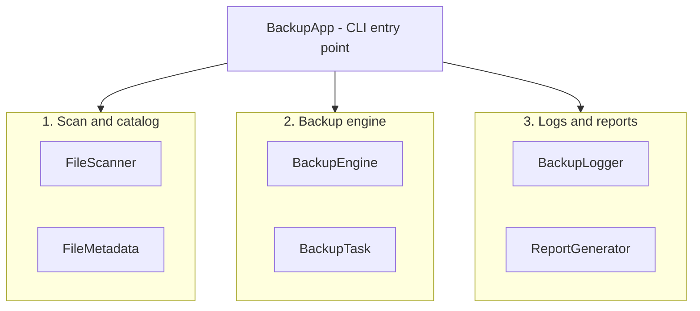
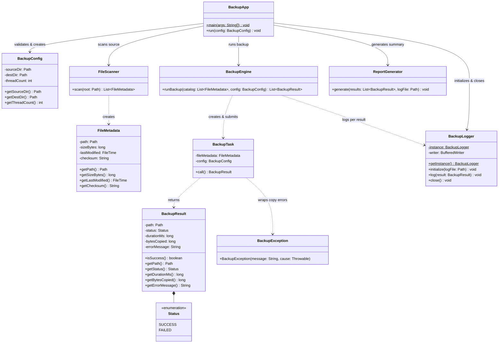
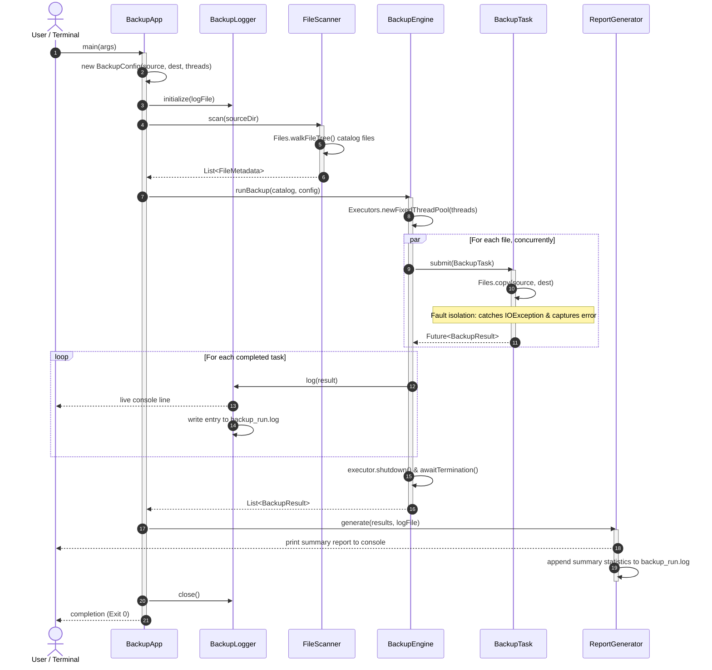
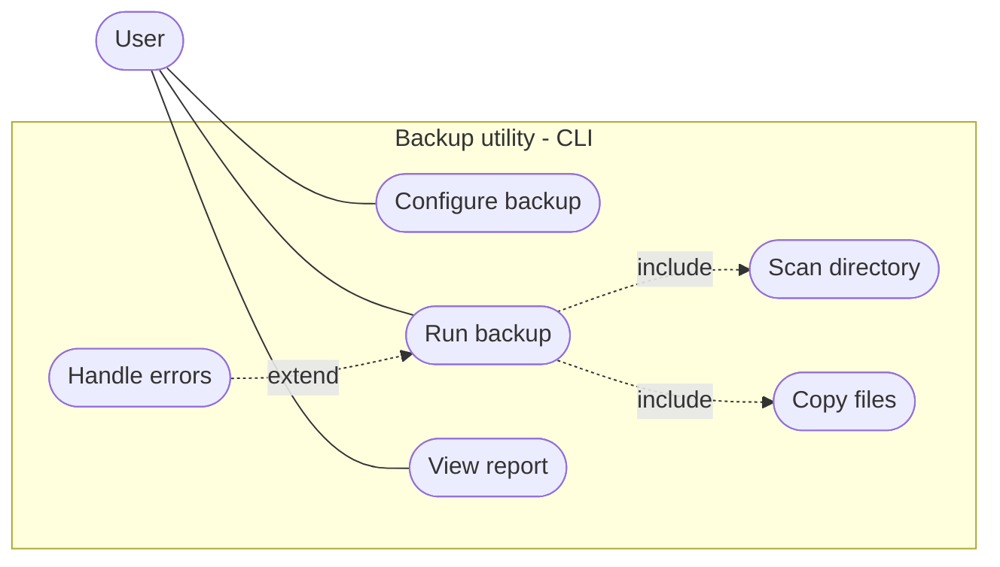
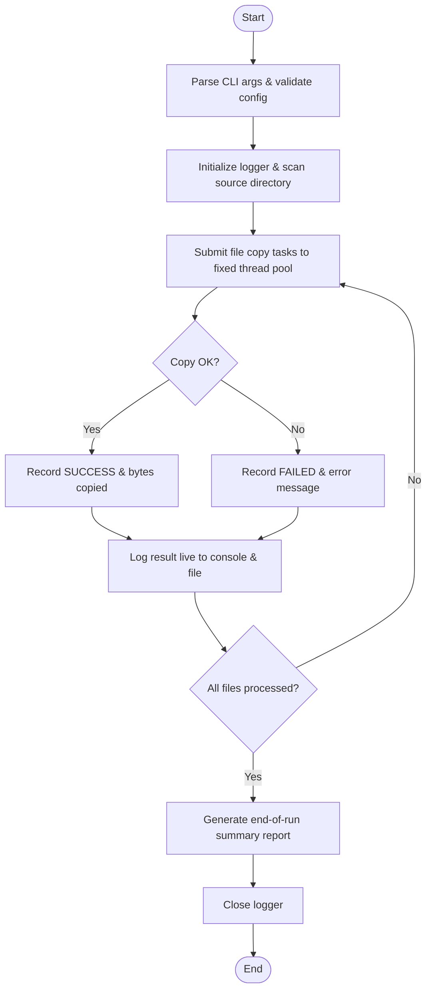

# Diagrams

## 1. System architecture

```mermaid
flowchart TD
    App["BackupApp - CLI entry point"]
    subgraph M1["1. Scan and catalog"]
        FS["FileScanner"]
        FM["FileMetadata"]
    end
    subgraph M2["2. Backup engine"]
        BE["BackupEngine"]
        BT["BackupTask"]
    end
    subgraph M3["3. Logs and reports"]
        BL["BackupLogger"]
        RG["ReportGenerator"]
    end
    App --> M1
    App --> M2
    App --> M3
```

## 2. Class diagram

```mermaid
classDiagram
    class BackupApp {
        +main(args: String[]) void$
        +run(config: BackupConfig) void
    }
    class BackupConfig {
        -sourceDir: Path
        -destDir: Path
        -threadCount: int
        +getSourceDir() Path
        +getDestDir() Path
        +getThreadCount() int
    }
    class FileScanner {
        +scan(root: Path) List~FileMetadata~
    }
    class FileMetadata {
        -path: Path
        -sizeBytes: long
        -lastModified: FileTime
        -checksum: String
        +getPath() Path
        +getSizeBytes() long
        +getLastModified() FileTime
        +getChecksum() String
    }
    class BackupEngine {
        +runBackup(catalog: List~FileMetadata~, config: BackupConfig) List~BackupResult~
    }
    class BackupTask {
        -fileMetadata: FileMetadata
        -config: BackupConfig
        +call() BackupResult
    }
    class BackupResult {
        -path: Path
        -status: Status
        -durationMs: long
        -bytesCopied: long
        -errorMessage: String
        +isSuccess() boolean
        +getPath() Path
        +getStatus() Status
        +getDurationMs() long
        +getBytesCopied() long
        +getErrorMessage() String
    }
    class Status {
        <<enumeration>>
        SUCCESS
        FAILED
    }
    class BackupException {
        +BackupException(message: String, cause: Throwable)
    }
    class BackupLogger {
        -instance: BackupLogger$
        -writer: BufferedWriter
        +getInstance() BackupLogger$
        +initialize(logFile: Path) void
        +log(result: BackupResult) void
        +close() void
    }
    class ReportGenerator {
        +generate(results: List~BackupResult~, logFile: Path) void
    }

    BackupApp --> BackupConfig : validates & creates
    BackupApp --> FileScanner : scans source
    BackupApp --> BackupEngine : runs backup
    BackupApp --> ReportGenerator : generates summary
    BackupApp --> BackupLogger : initializes & closes
    FileScanner ..> FileMetadata : creates
    BackupEngine ..> BackupTask : creates & submits
    BackupEngine ..> BackupLogger : logs per result
    BackupTask ..> BackupResult : returns
    BackupTask ..> BackupException : wraps copy errors
    BackupResult *-- Status
```

## 3. Sequence diagram

```mermaid
sequenceDiagram
    autonumber
    actor User as User / Terminal
    participant App as BackupApp
    participant Logger as BackupLogger
    participant Scanner as FileScanner
    participant Engine as BackupEngine
    participant Task as BackupTask
    participant Report as ReportGenerator

    User->>App: main(args)
    activate App
    App->>App: new BackupConfig(source, dest, threads)
    App->>Logger: initialize(logFile)
    
    App->>Scanner: scan(sourceDir)
    activate Scanner
    Scanner->>Scanner: Files.walkFileTree() catalog files
    Scanner-->>App: List<FileMetadata>
    deactivate Scanner

    App->>Engine: runBackup(catalog, config)
    activate Engine
    Engine->>Engine: Executors.newFixedThreadPool(threads)

    par For each file, concurrently
        Engine->>Task: submit(BackupTask)
        activate Task
        Task->>Task: Files.copy(source, dest)
        Note over Task: Fault isolation: catches IOException & captures error
        Task-->>Engine: Future<BackupResult>
        deactivate Task
    end

    loop For each completed task
        Engine->>Logger: log(result)
        Logger-->>User: live console line
        Logger->>Logger: write entry to backup_run.log
    end

    Engine->>Engine: executor.shutdown() & awaitTermination()
    Engine-->>App: List<BackupResult>
    deactivate Engine

    App->>Report: generate(results, logFile)
    activate Report
    Report-->>User: print summary report to console
    Report->>Report: append summary statistics to backup_run.log
    deactivate Report

    App->>Logger: close()
    App-->>User: completion (Exit 0)
    deactivate App
```

## 4. Use case diagram

```mermaid
flowchart LR
    User(["User"])
    subgraph System["Backup utility - CLI"]
        UC1(["Configure backup"])
        UC2(["Run backup"])
        UC3(["View report"])
        UC4(["Scan directory"])
        UC5(["Copy files"])
        UC6(["Handle errors"])
    end
    User --- UC1
    User --- UC2
    User --- UC3
    UC2 -. include .-> UC4
    UC2 -. include .-> UC5
    UC6 -. extend .-> UC2
```

## 5. Workflow / process flow diagram

```mermaid
flowchart TD
    Start(["Start"]) --> A["Parse CLI args & validate config"]
    A --> B["Initialize logger & scan source directory"]
    B --> C["Submit file copy tasks to fixed thread pool"]
    C --> D{"Copy OK?"}
    D -->|Yes| E["Record SUCCESS & bytes copied"]
    D -->|No| F["Record FAILED & error message"]
    E --> G["Log result live to console & file"]
    F --> G
    G --> H{"All files processed?"}
    H -->|No| C
    H -->|Yes| I["Generate end-of-run summary report"]
    I --> J["Close logger"]
    J --> End(["End"])
```
