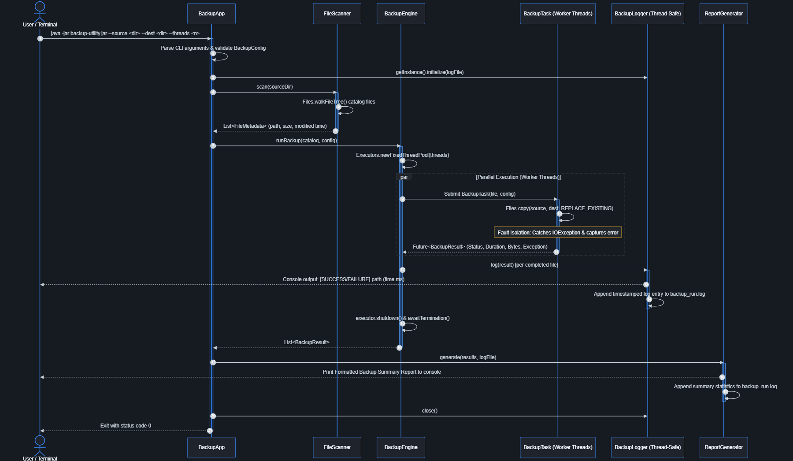
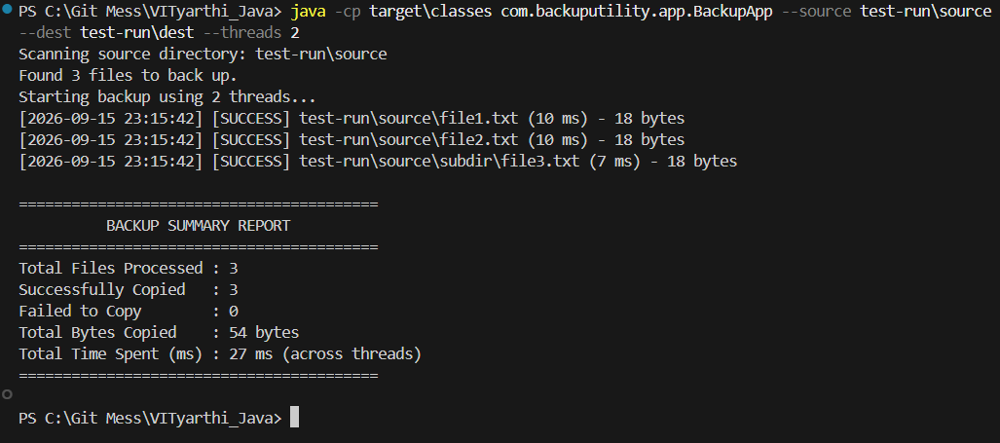

# Multithreaded File Backup Utility

A Java command-line utility that backs up files from a source directory to
a destination directory using a configurable thread pool, so files copy in
parallel instead of one at a time. Every operation is logged, and a summary
report is printed at the end of each run.

## Overview

Copying large directory trees sequentially is slow and gives no visibility
into what succeeded or failed. This tool scans a source directory, copies
its contents to a destination directory using multiple worker threads
concurrently, isolates per-file failures so one bad file doesn't abort the
run, and reports a full summary (files copied, failed, total size, elapsed
time) when it finishes.

It is fully driven from the terminal — there is no GUI.

## Features

- **Directory scanning & cataloging** — recursively scans the source
  directory and builds a catalog of files to back up (path, size,
  last-modified time).
- **Multi-threaded backup engine** — copies files concurrently via a fixed
  thread pool (`ExecutorService` + `Callable<BackupResult>`), with the
  pool size configurable at runtime.
- **Logging & reporting** — a thread-safe logger records every file
  operation as it happens; a report generator prints and saves an
  end-of-run summary.
- **Fault isolation** — a single file failure (permissions, missing path,
  disk full) is caught, logged, and reported — it never crashes the run
  or stops other files from being copied.

## Technologies / tools used

- Java 17
- `java.nio.file` (file I/O)
- `java.util.concurrent` (`ExecutorService`, `Callable`, `Future`)
- JUnit 5 for unit and integration tests
- Maven for build and dependency management
- Git for version control

## Prerequisites

- **Java 17 or higher** — check with `java -version`
- **Maven 3.6 or higher** — check with `mvn -version`

## Setup & installation

1. Clone the repository:
   ```bash
   git clone https://github.com/joydeepd900/multithreaded-file-backup-utility.git
   cd multithreaded-file-backup-utility
   ```

2. Build the project:
   ```bash
   mvn clean package
   ```

   > **Note:** `pom.xml` is already pre-configured with `maven-jar-plugin` (version 3.3.0)
   > to declare `com.backuputility.app.BackupApp` as the `Main-Class` manifest attribute:
   > ```xml
   > <plugin>
   >   <groupId>org.apache.maven.plugins</groupId>
   >   <artifactId>maven-jar-plugin</artifactId>
   >   <version>3.3.0</version>
   >   <configuration>
   >     <archive>
   >       <manifest>
   >         <mainClass>com.backuputility.app.BackupApp</mainClass>
   >       </manifest>
   >     </archive>
   >   </configuration>
   > </plugin>
   > ```
   > Running `mvn clean package` automatically builds an executable JAR ready to run with `java -jar`.

## Running the application

```bash
java -jar target/multithreaded-file-backup-utility-1.0-SNAPSHOT.jar \
  --source /path/to/source \
  --dest /path/to/destination \
  --threads 4
```

### Command-line arguments

| Argument | Description | Required | Default |
|---|---|---|---|
| `--source <path>` | Directory to back up | Yes | — |
| `--dest <path>` | Destination directory | Yes | — |
| `--threads <number>` | Number of worker threads | No | 4 |

### Example

```bash
# Back up the Documents folder to Backup using 8 threads
java -jar target/multithreaded-file-backup-utility-1.0-SNAPSHOT.jar \
  --source /home/user/Documents \
  --dest /home/user/Backup \
  --threads 8
```

On completion, the console prints a summary (files copied, failed, total
bytes, elapsed time), and the same summary is written to a log file.

## Testing

Run the full test suite (unit tests for scanning/config/logging, plus an
integration test that runs a real backup against a temp directory
including an intentionally-failing file) with:

```bash
mvn test
```

## Project structure

```
com.backuputility
├── app       – BackupApp (entry point), BackupConfig
├── scanner   – FileScanner, FileMetadata
├── engine    – BackupEngine, BackupTask, BackupResult, BackupException
├── logging   – BackupLogger (thread-safe)
└── report    – ReportGenerator
```

## Documentation

- [`statement.md`](./statement.md) — problem statement, scope, and target users
- [`architecture.md`](./ProjectDocs/architecture.md) — module design, class responsibilities, concurrency model
- [`PRD.md`](./ProjectDocs/PRD.md) — full functional and non-functional requirements
- [`backup_utility_sequence_diagram.png`](./ProjectDocs/backup_utility_sequence_diagram.png) — execution flow & concurrency sequence diagram

## Screenshots

### Execution Flow Sequence Diagram



### Terminal Test Run Output

